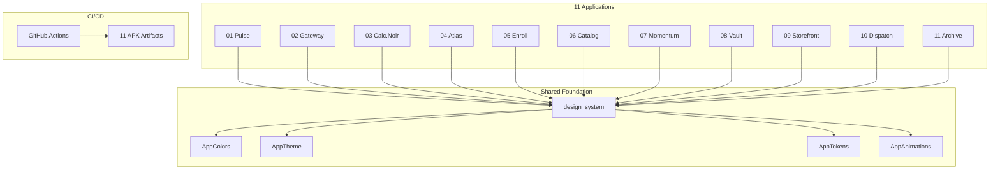

<div align="center">

  <h1>🧪 Flutter UI Lab</h1>
  <p><strong>11 Hyper-Aesthetic Flutter Applications</strong></p>
  <p>
    <em>A unified design system powering premium mobile experiences — neumorphism, glassmorphism, fluid animations, and modern UX patterns.</em>
  </p>

  <br />

  
  
  
  
  

  <br /><br />

  <a href="#-the-collection">Apps</a> •
  <a href="#-design-system">Design System</a> •
  <a href="#-tech-stack">Tech Stack</a> •
  <a href="#-architecture">Architecture</a> •
  <a href="#-quick-start">Quick Start</a>

</div>

<br />

## 💡 What Is This?

Not homework. A **design laboratory**.

11 Flutter applications — each solving a different mobile programming challenge — unified under a single, obsessively crafted design system. Every app shares the same typography, color palette, spacing grid, animation presets, and component library. The result feels like opening 11 apps from the same premium software studio.

> *"We don't build pages; we build moments."*

<br />

## 📱 The Collection

| # | App | Concept | Key Features |
|:-:|:---:|:--------|:-------------|
| 01 | **Pulse** | Neumorphic Counter | Spring animations, haptic feedback, progress ring |
| 02 | **Gateway** | Glassmorphic Login | Frosted glass card, ambient orbs, biometric hint |
| 03 | **Calc.Noir** | Dark Calculator | Teenage Engineering aesthetic, monospace display, text glow |
| 04 | **Atlas** | Navigation Showcase | Hero transitions, morphing tab bar, custom app icon |
| 05 | **Enroll** | Registration Wizard | 3-step form, real-time validation, confetti success |
| 06 | **Catalog** | Magazine Feed | Staggered animations, shimmer loading, pull-to-refresh |
| 07 | **Momentum** | Task Manager | Gesture-driven, swipe-to-dismiss, completion choreography |
| 08 | **Vault** | Settings/Preferences | Animated dark mode toggle, persistent state |
| 09 | **Storefront** | E-Commerce (API) | Product grid, cart, shimmer states, FakeStore API |
| 10 | **Dispatch** | News Reader (API) | Category tabs, breaking news badge, GNews API |
| 11 | **Archive** | Notes/Journal (SQLite) | CRUD operations, color labels, search filtering |

<br />

## 🎨 Design System

All 11 apps are powered by a shared `design_system` package:

| Token | Value | Purpose |
|:-----:|:-----:|:--------|
| **Typography** | Plus Jakarta Sans + JetBrains Mono | Premium geometric sans + monospace labels |
| **Colors** | Warm neutrals (`#FAFAF8` / `#1A1A18`) | Avoids sterile pure white/black |
| **Radii** | 8px → 32px scale | From chips to hero containers |
| **Shadows** | Neumorphic-lite dual shadows | Soft depth without heaviness |
| **Animations** | 4 presets (micro → dramatic) | Consistent motion language |
| **Dark Mode** | `#0F0F0F` base | For Calc.Noir, Vault, Gateway |

<br />

## 🛠️ Tech Stack

<div align="center">

| Layer | Technology | Purpose |
|:-----:|:----------:|:--------|
| **Framework** | Flutter 3.x | Cross-platform mobile development |
| **Language** | Dart 3.x | Type-safe, null-safe codebase |
| **Design** | Material 3 + Custom Design System | Unified premium aesthetic |
| **Typography** | Google Fonts (Plus Jakarta Sans) | Modern, geometric type hierarchy |
| **Animations** | flutter_animate | Declarative animation chaining |
| **State** | setState | Simple, professor-friendly state management |
| **Local Storage** | SharedPreferences + sqflite | Persistent data across sessions |
| **Networking** | http package | REST API integration |
| **CI/CD** | GitHub Actions | Cloud-based APK builds (zero local Gradle) |
| **Monorepo** | Melos | Multi-package workspace orchestration |

</div>

<br />

## 🏗️ Architecture



<br />

## 📁 Project Structure

```
flutter-ui-lab/
├── .github/workflows/
│   └── build-all.yml          # Parallel APK builds for all 11 apps
├── packages/
│   └── design_system/         # Shared colors, typography, tokens, animations
│       ├── lib/
│       │   ├── theme.dart
│       │   ├── tokens.dart
│       │   └── animations.dart
│       └── pubspec.yaml
├── apps/
│   ├── 01_pulse/              # Counter App
│   ├── 02_gateway/            # Login UI
│   ├── 03_calc_noir/          # Calculator
│   ├── 04_atlas/              # Navigation
│   ├── 05_enroll/             # Registration Form
│   ├── 06_catalog/            # ListView
│   ├── 07_momentum/           # To-Do App
│   ├── 08_vault/              # SharedPreferences
│   ├── 09_storefront/         # E-Commerce API
│   ├── 10_dispatch/           # News API
│   └── 11_archive/            # SQLite CRUD
├── melos.yaml                 # Monorepo orchestrator
└── README.md
```

<br />

## 🚀 Quick Start

### Prerequisites

- **Flutter** ≥ 3.10
- **Dart** ≥ 3.0

### Run Any App

```bash
# Clone the repository
git clone https://github.com/Shreekumar-Shah-AICTE/flutter-ui-lab.git
cd flutter-ui-lab

# Navigate to any app
cd apps/01_pulse

# Install dependencies
flutter pub get

# Run on connected device
flutter run
```

### Build APKs (Cloud)

APKs are built automatically via GitHub Actions on every push to `main`. Download them from the **Actions** tab → select the latest run → **Artifacts**.

<br />

## 👤 Author

<div align="center">

|  |
|:---:|
| **Shreekumar Shah** |
| [@Shreekumar-Shah-AICTE](https://github.com/Shreekumar-Shah-AICTE) |
| BCA • School of Computing • Kaushalya – The Skill University |

</div>

<br />

## 📄 License

This project is open source and available under the [MIT License](LICENSE).

---

<div align="center">
  <br />
  <em>"Some things are built. Others are felt."</em>
  <br /><br />
</div>
