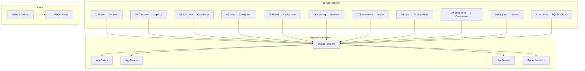

<div align="center">

  <h1>🧪 Flutter UI Lab</h1>
  <p><strong>11 Hyper-Aesthetic Flutter Applications</strong></p>
  <p>
    <em>A unified design system powering premium mobile experiences — neumorphism, glassmorphism, fluid animations, and modern UX patterns.</em>
  </p>
  <p><sub>Mobile Programming Practicals • Prof. Akash Padhiyar • School of Computing</sub></p>

  <br />

  
  
  
  
  

  <br /><br />

  <a href="#-the-11-practicals">Practicals</a> •
  <a href="#-design-system">Design System</a> •
  <a href="#-tech-stack">Tech Stack</a> •
  <a href="#-architecture">Architecture</a> •
  <a href="#-quick-start">Quick Start</a>

</div>

<br />

## 💡 What Is This?

11 Flutter applications — each solving a different **mobile programming practical assignment** — unified under a single, obsessively crafted design system. Every app shares the same typography, color palette, spacing grid, animation presets, and component library. The result feels like opening 11 apps from the same premium software studio.

> *"Satisfy the academic requirements perfectly, but wrap them in ultra-premium, Apple-tier UI/UX."*

<br />

## 📱 The 11 Practicals

| # | Folder | Academic Title | Codename | Key Features |
|:-:|:------:|:---------------|:--------:|:-------------|
| 01 | `01_pulse` | **Counter Application** | Pulse | Neumorphic dial, spring animations, haptic feedback, progress ring |
| 02 | `02_gateway` | **Simple Login UI** | Gateway | Glassmorphic card, ambient orbs, BackdropFilter blur, biometric hint |
| 03 | `03_calc_noir` | **Simple Calculator** | Calc.Noir | Dark synth aesthetic, monospace display, text glow, witty ÷0 |
| 04 | `04_atlas` | **Navigation and App Icon** | Atlas | Hero transitions, morphing tab bar, custom adaptive launcher icon |
| 05 | `05_enroll` | **Student Registration Form with Validation** | Enroll | 3-step wizard, real-time validation, confetti success animation |
| 06 | `06_catalog` | **ListView Implementation** | Catalog | Magazine feed, staggered animations, shimmer loading, pull-to-refresh |
| 07 | `07_momentum` | **To-Do Application** | Momentum | Gesture-driven, swipe-to-dismiss, completion choreography |
| 08 | `08_vault` | **SharedPreferences Implementation** | Vault | Animated dark mode toggle, persistent settings, theme crossfade |
| 09 | `09_storefront` | **E-Commerce App UI (Using API)** | Storefront | Product grid, cart, shimmer states, FakeStore API integration |
| 10 | `10_dispatch` | **News Application (Using API)** | Dispatch | Category tabs, breaking news badge, GNews API, pull-to-refresh |
| 11 | `11_archive` | **CRUD Operations using SQLite Database** | Archive | Color-coded notes, masonry grid, search, sqflite CRUD |

> 📌 **Each app folder contains its own `README.md`** with the full academic title, features, and implementation details.

<br />

## 🎨 Design System

All 11 apps are powered by a shared `design_system` package:

| Token | Value | Purpose |
|:-----:|:-----:|:--------|
| **Typography** | Plus Jakarta Sans + JetBrains Mono | Premium geometric sans + monospace labels |
| **Colors** | Warm neutrals (`#FAFAF8` / `#1A1A18`) | Avoids sterile pure white/black |
| **Radii** | 8px → 32px scale | From chips to hero containers |
| **Shadows** | Neumorphic-lite dual shadows | Soft depth without heaviness |
| **Animations** | 4 presets (micro → dramatic) | Consistent motion language |
| **Dark Mode** | `#0F0F0F` base | For Calc.Noir, Vault, Gateway |

<br />

## 🛠️ Tech Stack

<div align="center">

| Layer | Technology | Purpose |
|:-----:|:----------:|:--------|
| **Framework** | Flutter 3.x | Cross-platform mobile development |
| **Language** | Dart 3.x | Type-safe, null-safe codebase |
| **Design** | Material 3 + Custom Design System | Unified premium aesthetic |
| **Typography** | Google Fonts (Plus Jakarta Sans) | Modern, geometric type hierarchy |
| **Animations** | flutter_animate | Declarative animation chaining |
| **State** | setState | Simple, professor-friendly state management |
| **Local Storage** | SharedPreferences + sqflite | Persistent data across sessions |
| **Networking** | http package | REST API integration |
| **CI/CD** | GitHub Actions | Cloud-based APK builds (zero local Gradle) |
| **Monorepo** | Melos | Multi-package workspace orchestration |

</div>

<br />

## 🏗️ Architecture



<br />

## 📁 Project Structure

```
flutter-ui-lab/
├── .github/workflows/
│   └── build-all.yml              # Parallel APK builds for all 11 apps
├── packages/
│   └── design_system/             # Shared colors, typography, tokens, animations
│       ├── lib/
│       │   ├── theme.dart
│       │   ├── tokens.dart
│       │   └── animations.dart
│       └── pubspec.yaml
├── apps/
│   ├── 01_pulse/                  # Practical 1: Counter Application
│   ├── 02_gateway/                # Practical 2: Simple Login UI
│   ├── 03_calc_noir/              # Practical 3: Simple Calculator
│   ├── 04_atlas/                  # Practical 4: Navigation and App Icon
│   ├── 05_enroll/                 # Practical 5: Student Registration Form
│   ├── 06_catalog/                # Practical 6: ListView Implementation
│   ├── 07_momentum/               # Practical 7: To-Do Application
│   ├── 08_vault/                  # Practical 8: SharedPreferences
│   ├── 09_storefront/             # Practical 9: E-Commerce App UI (API)
│   ├── 10_dispatch/               # Practical 10: News Application (API)
│   └── 11_archive/                # Practical 11: SQLite CRUD Operations
├── melos.yaml                     # Monorepo orchestrator
└── README.md
```

<br />

## 🚀 Quick Start

### Prerequisites

- **Flutter** ≥ 3.10
- **Dart** ≥ 3.0

### Run Any App

```bash
# Clone the repository
git clone https://github.com/Shreekumar-Shah-AICTE/flutter-ui-lab.git
cd flutter-ui-lab

# Navigate to any app (e.g., Counter Application)
cd apps/01_pulse

# Install dependencies
flutter pub get

# Run on connected device
flutter run
```

### Build APKs (Cloud)

APKs are built automatically via GitHub Actions on every push to `main`. Download them from the **Actions** tab → select the latest run → **Artifacts**.

<br />

## 👤 Author

<div align="center">

|  |
|:---:|
| **Shreekumar Shah** |
| [@Shreekumar-Shah-AICTE](https://github.com/Shreekumar-Shah-AICTE) |
| BCA • School of Computing • Kaushalya – The Skill University |

</div>

<br />

## 📄 License

This project is open source and available under the [MIT License](LICENSE).

---

<div align="center">
  <br />
  <em>"Some things are built. Others are felt."</em>
  <br /><br />
</div>
